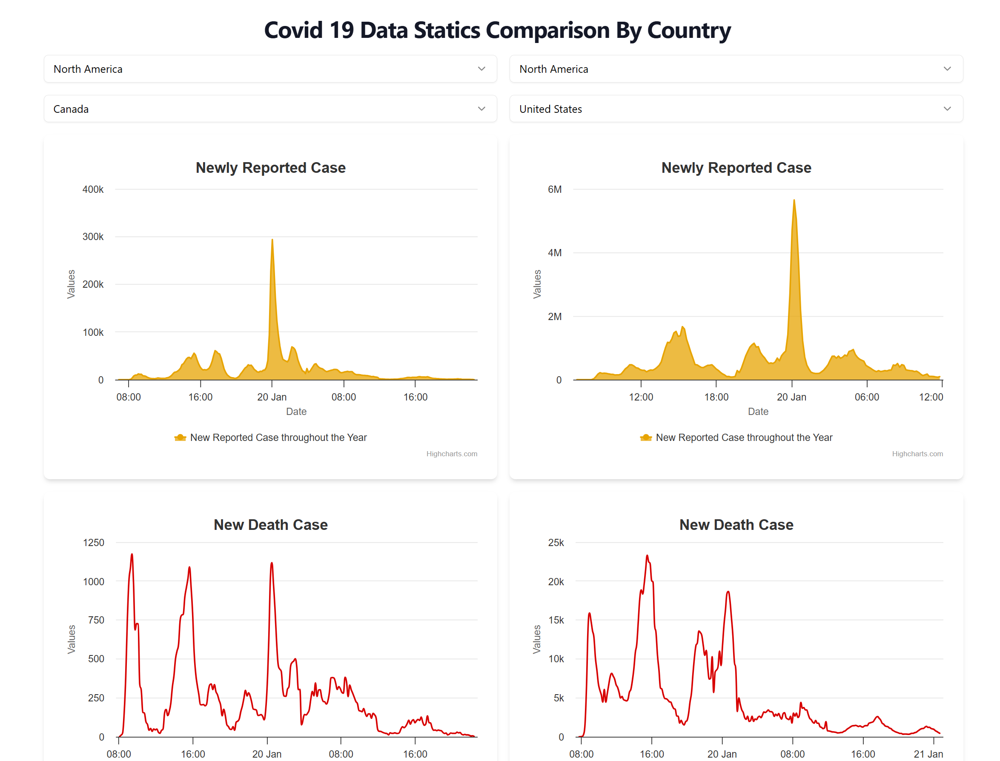
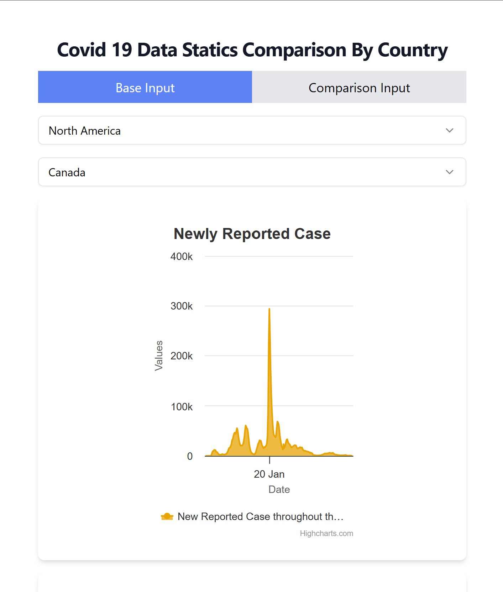
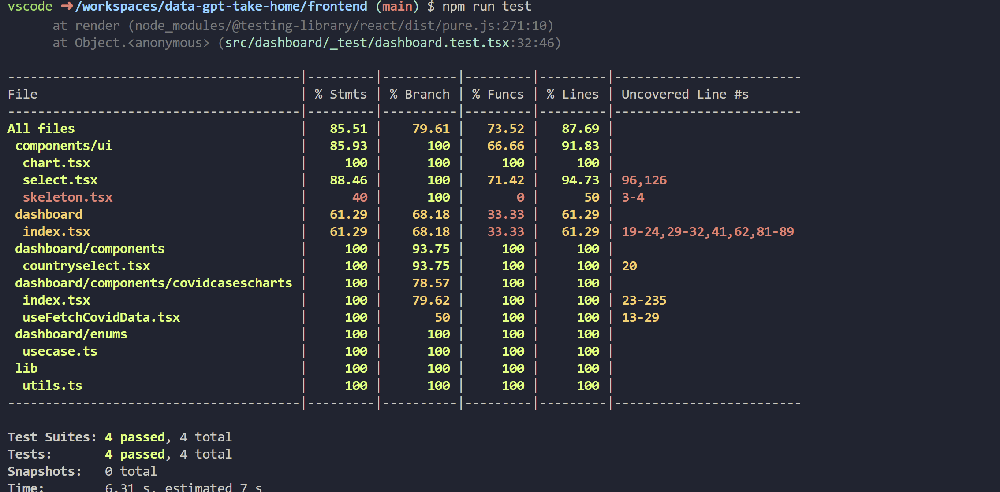
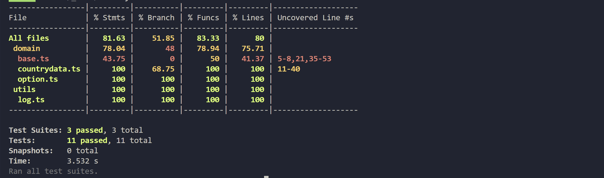

# Covid-19 Dashboard Comparison full stack Application 

## Desktop


## Mobile




# Prequisties 
- Docker & Docker Compose
- Node Version 20.x.x

# Setting up Database on Local
- First Download the initial csv file from https://github.com/owid/covid-19-data
- Save the data into folder `init/dataset` and change the file name into  *covid-data-setgg.csv*
- Then run the following command to start postgres DB with initial import from csv on Docker Contianer

### Starting Database Container in DetachMode
After cloning project , browse to the project folder and run the following command 
```
docker-compose up -d
```

### Shutting down the database container 
```
docker-compose down
```

# Starting the Backend
After starting the database. 
you will have to run the library installation using this command 
```
npm i

```
Then start the development server using following command 
```
npm run start
```
And the it will run in your http://localhost:5000. 


## Backend API Endpoint List

| Endpoint                                      | Description                                       | Method | Request Parameters                                       | Response       |
|-----------------------------------------------|---------------------------------------------------|--------|----------------------------------------------------------|----------------|
| `/options/continent`                          | Get a list of continents.                         | GET    | None                                                     | Not specified  |
| `/options/country?continent=asia`             | Get a list of countries for a specific continent. | GET    | `continent`: The continent for which to fetch countries   | Not specified  |
| `/countrydata/uc_new_reported?country=myanmar` | Get chart data for new reported cases by country. | GET    | `country`: The country for which to retrieve data         | Not specified  |
| `/countrydata/uc_death_rate?country=canada`   | Get chart data for death rate by country.         | GET    | `country`: The country for which to retrieve data         | Not specified  |
| `/countrydata/uc_new_reported?country=myanmar` | Get chart data for ICU vs. hospitalized cases.    | GET    | `country`: The country for which to retrieve data         | Not specified  |
| `/countrydata/uc_vaccination_percentage?country=canada` | Get chart data for vaccination coverage percentage. | GET    | `country`: The country for which to retrieve data         | Not specified  |


## Importing the Postman Collection 

You can import the postman collection using [this Json File](APIPostmanCollection.json)

# Front End
After starting the Backend navigate to frontend folder from your terminal and 
you will have to run the library installation using this command 
```
npm i

```
Then start the development server using following command 
```
npm run dev
```
And the it will display the URL on terminal to navigate to the frontend App. 


# Running the test

You can run the test using following command on frontend & backend folder respectively. 

```
npm run test
```

## Test Coverage
### Frontend 


### Backend



# Libraries

## Frontend Libraries
| Dependency                        | Usage Purpose                                                                                               |
|-----------------------------------|-------------------------------------------------------------------------------------------------------------|
| @radix-ui/react-select            | Provides accessible and customizable select components for React applications.                             |
| @radix-ui/react-slot              | Offers primitives for building accessible, composable, and design-system aware components in React.        |
| @shadcn/ui                        | Library for UI components that can be used to build interfaces in React applications.                       |
| class-variance-authority          | Library for handling class variance and authority in JavaScript applications.                               |
| clsx                             | Utility for constructing className strings conditionally in React components.                               |
| highcharts                        | JavaScript charting library that enables interactive charts to be added to web applications.                |
| highcharts-react-official         | Official React wrapper for Highcharts, allowing Highcharts to be used in React applications.                |
| lucide-react                      | Provides a collection of simple icons that can be used in React applications.                                |
| react                             | JavaScript library for building user interfaces in web applications.                                         |
| react-dom                         | Library providing DOM-specific methods that can be used with React applications.                             |
| tailwind-merge                    | Utility for merging Tailwind CSS classes together in a concise manner.                                        |
| tailwindcss-animate               | Library for adding animation utilities to Tailwind CSS classes for web interfaces.                            |


## Backend Libraries

| Dependency         | Usage Purpose                                                                                           |
|--------------------|---------------------------------------------------------------------------------------------------------|
| body-parser        | Node.js body parsing middleware. Used to parse incoming request bodies in a middleware before handlers. |
| cors               | Node.js CORS middleware. Enables Cross-Origin Resource Sharing for Express.js.                          |
| express            | Fast, unopinionated, minimalist web framework for Node.js. Used for building web applications and APIs. |
| node-postgres      | PostgreSQL client for Node.js. Enables Node.js applications to interact with PostgreSQL databases.      |
| pg                 | PostgreSQL client for Node.js. Provides a native interface for interacting with PostgreSQL databases.   |